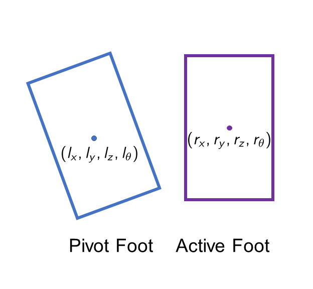
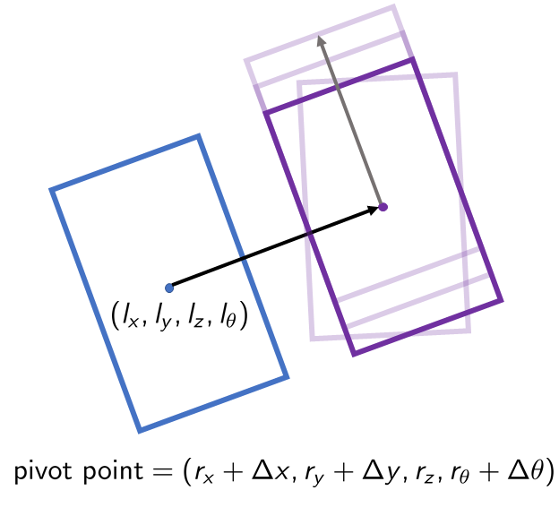

# Defining Robot Parameters

Information about the size and dynamics of the robot are stored in a file called `robot_parameters.msg`. The `robot_parameters.msg` in this directory defines parameters for a [Poppy Humanoid Robot](https://www.poppy-project.org/en/). 

### Scalar components
The first six lines of `robot_parameters.msg` are defined as follows:
```yaml
height_m: _height of robot in meters_
in_radius_m: _distance from the center of the robot to the end of torso in meters_
foot_length_m: _length of a foot in meters_
foot_width_m: _width of a foot in meters_
nominal_offset_m: _nominal distance between centers of the two feet in meters_
num_theta_vals: _number of possible robot orientations_
goal_tolerance_m: _radius of the goal region around the goal point in meters_
```
`num_theta_vals` is used to calculate the delta theta (change in foot orientation) for the motion primitives. More specifically, delta theta = `2*PI / num_theta_vals`. If `goal_tolerance_m` is set to 0.2, then the search terminates when the humanoid is within 0.2 meters of the goal state. 

### Collision Spheres
The next portion of `robot_parameters.msg` defines the *collision spheres* for the robot. If any of the collision spheres intersect with any obstacles, then the robot is in collision. The `x, y, z` values of the spheres are offsets from the `origin` of that sphere. `origin` can take on the values `LEFT_FOOT` (center point of left foot), `RIGHT_FOOT` (center point of right foot), `FEET_CENTER` (center point between the feet). Each sphere is defined as follows:
```yaml
collision_spheres {
  x: _x offset from origin in meters_
  y: _y offset from origin in meters_
  z: _z offset from origin in meters_
  radius: _radius of sphere in meters_
  origin: _the origin of the sphere_
}

```

### Motion Primitives
The end of the `robot_parameters.msg` file is a series of `motion_primitives`. A single motion primitive defines the magnitude of the forward direction vector and the z-direction vector from a pivot point:
```yaml
motion_primitives {
  dx: _magnitude of the x-component of the forward direction vector_
  dy: _magnitude of the y-component of the forward direction vectorn_
  dz: _magnitude of the z-unit vector_
}
```
Remember to define your motion primitives in the *discretized* coordinate frame. The successors are found in the *world* coordinate frame using the motion primitive in the following format: `(dx*cell_size, dy*cell_size, dz*cell_size, 2*PI/num_theta_vals)`. `2*PI/num_theta_vals` is the delta theta/orientation of the foot. The cell size is defined in the [scenario description](https://github.com/vinitha910/homotopy_guided_footstep_planner/blob/master/src/footstep_planner/python/README.md#creating-test-scenarios).

The `active foot` is the foot we want expand and its potential successors are found with respect to the `pivot foot`. 
<p align="center">
  
</p>

We extend a vector, with a magnitude of `nominal_offset_m`, along the x-axis of the right foot's origin (r_x, r_y, r_z, r_theta). Note, if the pivot foot is left foot, we would extend a vector along the x-axis of the left foot's origin (l_x, l_y, l_z, l_theta) in the **negative direction**). The terminal point of the vector is the *pivot point*.
<p align="center">
  
</p>

We then apply the motion primitives along the forward-direction vector (grey arrow) and the z-unit vector extending from the pivot point. We can also rotate around around the pivot point by `2*PI/num_theta_vals`. If the `active foot` is the right foot, we rotate in the clockwise direction, otherwise we rotate in the counterclockwise direction. The light purple rectangles are examples of potential successors for the `active foot`.
<p align="center">
  
</p>
