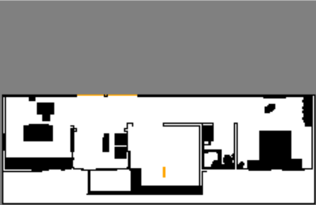
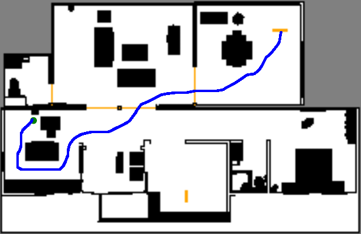
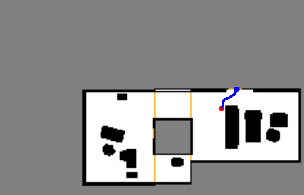

# Dependencies
The files in this directory use `python 2.7` and depend on the following packages:
- `python-tk`
- `numpy` >= 1.8.2
- `matplotlib` >= 1.3.1
- `python-protobuf`
- `yaml`

# Visualizing Projections
You can display the projections by running the following command:

```bash
python visualize_projections.py /path/to/projections.msg <WORKSPACE_INDEX>
```

For example, to visualize the first projected workspace you can run the following command from the `python` subdirectory:

```bash
python visualize_projections.py ../proto/projections.msg 0
```

You should see something similar to the following:
<p align="center">
  
</p>

Here, the color black represents obstacles, white is free space, the orange lines are gates and the gray area is outside the bounds of the workspace.

# Creating Test Scenarios

The `create_test_scenarios.py` script displays a GUI that can be used to create `yaml` files containing parameters defining the planning scenarios for the homotopy guided footstep planner. It is run by running the following command:

```bash
python create_test_scenarios.py /path/to/projections.msg /path/to/beams.msg /path/to/gates.msg <NAME_OF_WORLD_DIRECTORY>
```

You can draw trajectories from the green to the red circle in the GUI. The circles will only appear on the workspace they are on, so you may only see one circle at a time. To transition between workspaces draw the trajectory to a gate and the GUI will automatically display the other workspace connecting that gate. When you transition workspaces, a blue circle will appear on the point where you stopped drawing the trajectory on the previous workspace. You can continue drawing your trajectory for the blue circle. 

The `create_test_scenarios` script also allows for "batching" of the workspaces. This means that groups of workspaces can get displayed simultaneously in the GUI. For example, the first floor of a house, which may be defined as multiple workspaces, can be displayed in its entirety in the GUI using batching. Simply pass in a list as the last argument to the python script where each element of the list is a list of workspace indices which should be displayed together. In the house environment, we can batch by running the following command from the `python` subdirectory:

```bash
python create_test_scenarios.py ../proto/projections.msg ../proto/beams.msg ../proto/gates.msg house [[0,1,2,3],[4],[5,6,7,8,9],[10,11,12,13]]
```

When batching workspaces, you can draw over the gates that connected workspaces in the same batch with eachother. However, if you want to transition to a workspace not displayed in the GUI, you will need to draw the trajectory to the gate and then the GUI will display the appropiate batch of workspaces. Your trajectory may look similar to the following:

<p align="center">
  
  
  
</p>

When you have finished drawing the trajectory, press the `Add Signature` button the signature for your trajectory will automatically be extracted. You can draw as many trajectories as you want and when you are ready to save the file, press the `Save Test File` button. The `yaml` file outputted will look similar to the following:

```yaml
# List of the robot frames to visualize
frames: ["poppy_frame"] 

# String for the type of query
query_type: "complex"

# List of paths to the surface meshes
surfaces: ["package://footstep_planner/worlds/<NAME_OF_WORLD_DIRECTORY>/surfaces/surface_0.stl", ...] 

# List of paths to the stepping surface meshes
stepping_surfaces: ["package://footstep_planner/worlds/<NAME_OF_WORLD_DIRECTORY>/stepping_surfaces/stepping_surface_0.stl", ...] 

# Path to obstacle mesh
obstacles: "package://footstep_planner/worlds/<NAME_OF_WORLD_DIRECTORY>/obstacles.stl"

# Path to platforms mesh
platforms: "package://footstep_planner/worlds/<NAME_OF_WORLD_DIRECTORY>/platforms.stl"

# `true` to load the existing protobuf messages or `false` to regenerate the protobuf messages
load_proto_msgs: true

# Proto message package and paths
proto_msgs:
    package: "footstep_planner"
    robot_parameters: "/proto/robot_parameters.msg"
    projections: "/proto/projections.msg"
    stepping_cells: "/proto/valid_stepping_cells.msg"
    beams: "/proto/beams.msg"
    gates: "/proto/gates.msg"

# List of un-reduced signatures provided by the user
signatures: [[7, 8, -8], [7, 3]]

# List of h-signatures provided by the user
h_signatures: [[7], [7, 3]]

# Boolean for visualizing the various data
visualize:
    robot_model: false
    world: false
    collision_model: false
    anchor_heuristic: false
    homotopic_heuristic: false
    expansions: false
    path: false

# Map/World parameters
map_params:
    size_x: 23.8
    size_y: 15.3
    size_z: 5.2
    origin_x: 0.0
    origin_y: 0.0
    origin_z: 0.0
    cell_size: 0.1

# Start pose in 2.5D
start_pose:
    x: 97
    y: 137
    workspace: 1
    theta: 2.811

# Goal pose in 2.5D
goal_pose:
    x: 24
    y: 108
    workspace: 3
    theta: 1.482
```
