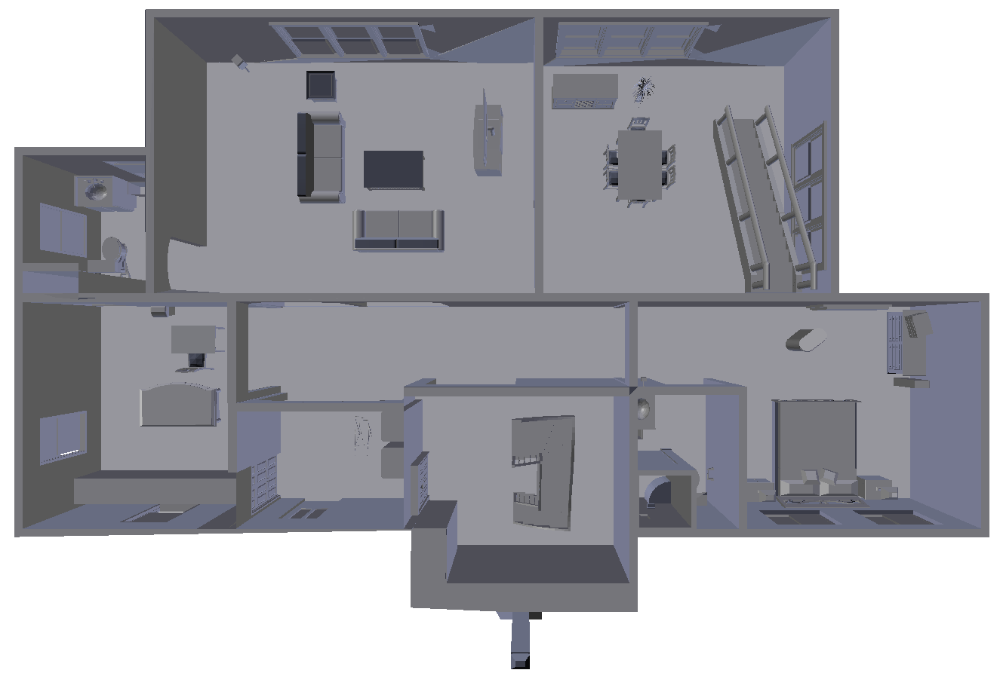
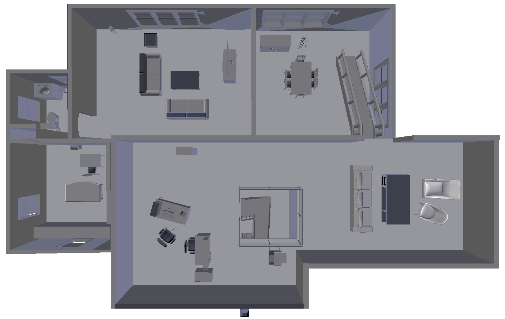
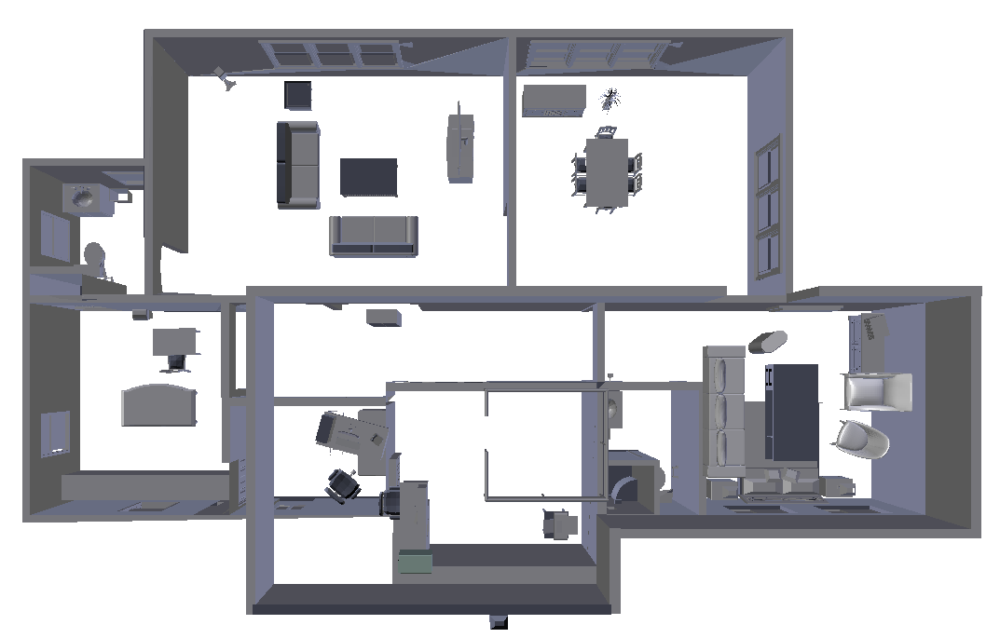
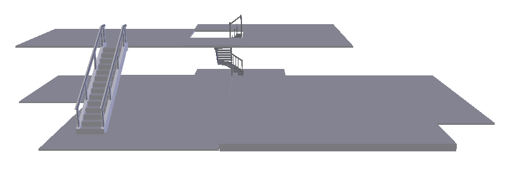
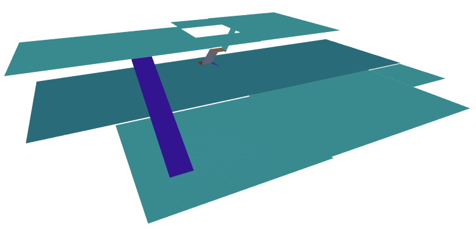

# How to Define Worlds #

## Introduction ##
A world of _platforms_, _obstacles_, _surfaces_, and _stepping surfaces_. Platforms and Obstacles make up the entirety of the physical environment in which robot operates. Surfaces are planes onto which we project our obstacles to create our 2D projected workspaces. Stepping surfaces are planes that we voxelize to determine which cells the robot can step on. The code takes in this information via a list of `.STL` files. We recommend using _Blender_ to model your environment, as the code also comes with a script that simplifies building the directory and exporting meshes.

The following documentation will walk through the various aspects of the "house" environment, in `worlds/house/house_blend.zip`.

<p align="center">
    
    
</p>

## Obstacles ##
Anything we don't want the robot to collide with is an obstacle. Examples include walls and furniture. 

<p align="center">
  
</p>

## Platforms ##
The platform is the rest of the environment that is not described by the obstacles. If the robot can step on this part of the environment, then it is included in the `platforms.stl` file. Examples of platforms include stairs, floors, ramps, etc. 

<p align="center">
  
</p>

## Surfaces ##
The world is segmented into multiple non-overlapping _surfaces_, each of which has its `.STL` file. We project the respective obstacles onto each of surfaces to create a series of 2D workspaces. For a given surface, there is a one-to-one mapping between (x, y) pairs and z-values. More complex platforms, such as the winding stairs, need to be represented with multiple surfaces.  

<p align="center">
  
</p>

## Stepping Surfaces ##
Each surface has a corresponding _stepping surface_. If a surface maps to a part of the platform that is flat, then the surface and stepping surface are identical. However, in the case of stairs or other parts of the platform that are not flat, the stepping surfaces identify where the robot can place its feet. 

<p align="center">
  
</p>


## Directory Structure and Exporting ##

A world directory should be laid out as follows: 
```
world_name/
    |_platforms.stl
    |_obstacles.stl
    |_surfaces/
        |_surface_0.stl
        |_...
        |_surface_n.stl
    |_stepping_surfaces/
        |_stepping_surface.stl
        |_...
        |_stepping_surface_n.stl
```

If the world is being modeled in blender, then simply store the platforms in a [group](https://docs.blender.org/manual/es/dev/editors/3dview/object/properties/relations/groups.html) called `platforms`, the obstacles in a group called `obstacles`, the ith surface goes in a group called `surface_i` and the ith stepping surface goes in a group called `stepping_surface_i`. 

`worlds/house/house_blend.zip` contains `house_world.blend`. You can view this blender file to see an example for how we grouped the various parts of the environment.

To export the meshes into the directory structure described above, run the following command from the `worlds/` directory:
```
blender <world_name>/<blender_file> --background --python export_meshes.py
```
